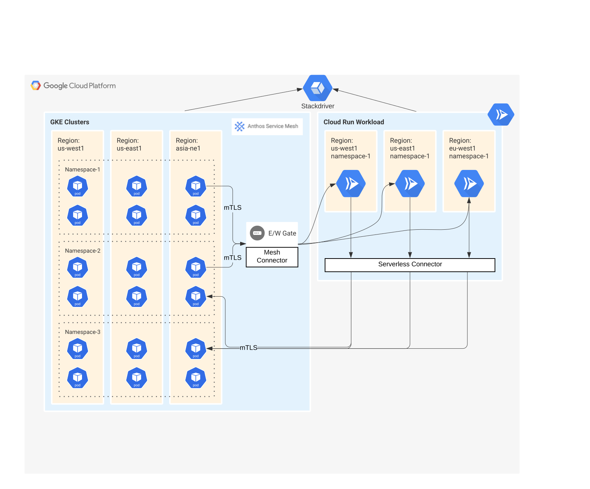

# Running a CloudRun or docker image in a mesh environment

> Cloud Run ASM is an experimental feature which isn't officially supported. We **do not** recommend using this 
feature in production at this stage.

This repository implements a small launcher that prepares a mesh environment and starts the user application.

## Overview

In K8s, the mesh implementation relies on a mutating webhook that patches the Pod, injecting for required environment.
Docker and CloudRun images do not have an injector so this application plays that role, using the K8s and GCP
APIs to setup iptables and the sidecar process or the proxyless bootstrap.

This supports running an app:

- in an Istio-like environment with a Sidecar and iptables interception
- if iptables is not available (gVisor, regular docker, dev machine), configure 'whitebox' mode ( HTTP_PROXY and
  localhost port forwarding for TCP)
- in proxyless gRPC mode for applications that natively support XDS and mesh, without iptables or sidecar.

The launcher is responsible for:

- discovering a GKE/K8s cluster based on environment (metadata server, env variables), and getting credentials and
  config
- discovering the XDS address and config (root certificates, metadata)
- setting up iptables ( equivalent to the init container or CNI in K8s ), or configuring 'whitebox' 
  mode if lacking permissions for iptables.
- launching envoy sidecar (optional for proxyless)
- configuring pilot-agent to intercept DNS
- launching the application after the network setup is stable
- creating any necessary tunnels to allow use of mTLS, based on the HBONE (tunneling over HTTP/2) proposal in Istio.
  For example in CloudRun each received mTLS connection is tunnelled as a HTTP/2 stream.

The repository also includes a specialised SNI-routing gateway and controller that allows any mesh node using mTLS to
tunnel requests to CloudRun with the expected authentication.

The user application will use the sidecar and XDS server to discover and communicate with other mesh workloads running 
in Pods, VMs or other mesh-enabled CloudRun services.

The code is based on the Istio VM startup script and injection template and will need to be kept in sync with future
changes in the mesh startup.

# Architecture



## Before you begin

Set the common environment variables used in this document:

```shell
# Project where the Cloud Run workload will be deployed.
export PROJECT_ID=wlhe-cr

# Project to deploy cluster config resources to. Defaults to PROJECT_ID.
# Override for multi project configurations where the GKE clusters are in a separate project from the Cloud Run resources.
export CONFIG_PROJECT_ID=${PROJECT_ID}

export CLUSTER_LOCATION=us-central1-c
export CLUSTER_NAME=asm-cr
# CloudRun region 
export REGION=us-central1

export WORKLOAD_NAMESPACE=fortio # Namespace where the CloudRun service will 'attach'
export WORKLOAD_NAME=cloudrun

# Name of the service account running the CloudRun service. It is recommended to use a dedicated SA for each K8s namespace
# and keep permissions as small as possible. 
# By default the namespace is extracted from the GSA name - if using a different SA or naming, WORKLOAD_NAMESPACE env
# is required when deploying the docker image. 
# (This may change as we polish the UX)
export CLOUDRUN_SERVICE_ACCOUNT=k8s-${WORKLOAD_NAMESPACE}@${PROJECT_ID}.iam.gserviceaccount.com

# Name for the cloudrun service - will use the same as the workload.
# Note that the service must be unique for region, if you want the same name in multiple namespace you must 
# use explicit config for WORKLOAD_NAME when deploying and unique cloudrun service name
export CLOUDRUN_SERVICE=${WORKLOAD_NAME}
````

## Install

Requirements:

- For each region, you need a Serverless connector, using the same network as the GKE cluster(s) and VMs. CloudRun will
  use it to communicate with the Pods/VMs. 
- All config clusters must have equivalent configuration - the CloudRun instance will attempt to connect to a cluster in same 
  region but may fallback to other regions.
- You must have admin permissions for the project and cluster during the initial setup.
- Required binaries include:
    - kubectl 
    - gcloud
    - envsubst

### Cluster setup (once per cluster)

1. If you don't already have a cluster with managed ASM,
   follow [Install docs](https://cloud.google.com/service-mesh/docs/managed-service-mesh). Also supported
   is [in-cluster ASM](https://cloud.google.com/service-mesh/docs/scripted-install/gke-install).

2. Configure the in-cluster 'mesh connector' gateway and permissions. (this step is temporary, WIP to upstream it to
   Istiod and the East-West gateway. Versions of Istio after upstreaming will not need this step.)

    ```shell 
    kubectl apply -k github.com/GoogleCloudPlatform/cloud-run-mesh/manifests/
    ```

Notes: 
- In-cluster ASM with `-ca mesh-ca` is not , but managed ASM is. You can use managed ASM by applying the `--managed` flag instead.
- OSS Istio requires additional setup steps, will be documented separately.

### Serverless connector setup (once per project / region / VPC network)

For each region where GKE and CloudRun will be
used, [install CloudRun connector](https://cloud.google.com/vpc/docs/configure-serverless-vpc-access).
Using the Cloud Console is usually easier. However, it  requires you to specify a /28 range. You can call the connector 'serverlesscon'. You will use this name to deploy the CloudRun service.

If you already have a connector, you can continue to use it and adjust the '--vpc-connector' parameter on the deploy
command.

The connector MUST be on the same VPC network with the GKE cluster and configured with a not-in-use CIDR range.

If your GKE cluster has enabled control plane authorized networks you must add the serverless connector CIDR range as an authorized network.


### Multi-project 

If you want to run the CloudRun service in a separate project, to better isolate the permissions:

- the cluster and the mesh connector will all run in the CONFIG_PROJECT_ID. 
- it is recommended (but not required) to have 1 config cluster per region.
- one or more shared VPCs should be used, in the CONFIG_PROJECT_ID 
- the servlerless connector will also run in the CONFIG_PROJECT_ID, associated with each shared VPC

The setup steps will allow the project used by CloudRun access to the VPC and serverless connector, as well as 
viewer (list cluster and connect) to the config clusters in CONFIG_PROJECT_ID, just like in single project config.

It is strongly recommended for the CloudRun project to be associated with a single K8S namespace. 
We plan to use part of the project ID as the default namespace, if the WORKLOAD_NAMESPACE is not 
explicitly configured. This simplifies the setup and reduces the risks, both namespace and projects
are intended to isolate service accounts and permissions. 

The workloads will act as K8S service account in the mapped K8s namespace.

## Namespace Setup

After installing you can only configure new services for namespaces using namespace-level permissions in K8s.
We recommend using a dedicated Google Service Account for each namespace. This requires IAM permissions
to setup (once per namespace).

The Google Service Account running the CloudRun service will be mapped to a K8s namespace. Currently the 'default'
K8s service account in the namespace is used - custom setup will be documented separately.

You must grant the service account used by CloudRun access to the GKE APIserver with minimal permissions.

A user or service account with namespace permissions in K8s can run these steps. It does not require K8s cluster
admin permissions, but it does require IAM permissions on the project running the CloudRun service.

1. Make sure you're using the current config cluster

    ```shell
    gcloud container clusters get-credentials ${CLUSTER_NAME} --zone ${CLUSTER_LOCATION} --project ${CONFIG_PROJECT_ID}
    ```

1. Create a Google service account for the CloudRun app using the pattern: k8s-NAMESPACE ( custom names are 
  also possible, but require extra manual configuration )

    ```shell
    gcloud iam service-accounts create k8s-${WORKLOAD_NAMESPACE} \
          --display-name "Service account with access to ${WORKLOAD_NAMESPACE} k8s namespace" \
          --project ${PROJECT_ID}
    ```

1. Grant '--role="roles/container.clusterViewer"' to the service account. This allows it to view the list of GKE clusters and 
   connect with minimal permissions ('authenticated' RBAC group)

    ```shell
    gcloud projects add-iam-policy-binding ${CONFIG_PROJECT_ID} \
                --member="serviceAccount:${CLOUDRUN_SERVICE_ACCOUNT}" \
                --role="roles/container.clusterViewer" \
                --project ${CONFIG_PROJECT_ID}
    ```

1. (multiproject only): Grant '--role="roles/serviceusage.serviceUsageConsumer" to the service account on the CONFIG_PROJECT. This allows it to 
   view the list of GKE clusters and connect, without enabling GKE API in the workload cluster. It also allows sending metrics to the config project.

    ```shell
    gcloud projects add-iam-policy-binding ${CONFIG_PROJECT_ID} \
                --member="serviceAccount:${CLOUDRUN_SERVICE_ACCOUNT}" \
                --role="roles/serviceusage.serviceUsageConsumer" \
                --project ${CONFIG_PROJECT_ID}
    ```

1. Grant additional RBAC permissions to the google service account, allowing it to access in-namespace config map and use
   TokenReview for the default KSA. (this step is also temporary, WIP to make it optional). This is used to get the
   MeshCA certificate and communicate with the managed control plane - Istio injector is mounting the equivalent tokens.
   If the app is using K8s, you should grant the required permissions to the mapped K8s service account ('default') - at 
   runtime the container is configured similarly to a Pod running as that KSA.

1. Make sure the namespace is created:

    ```shell
    kubectl create ns ${WORKLOAD_NAMESPACE} | true
    ```

1. Associate the Google Service Account with the K8s Namespace, allowing it to act as the default Kubernetes Service Account in the namespace:

    ```shell
    curl https://raw.githubusercontent.com/GoogleCloudPlatform/cloud-run-mesh/main/manifests/google-service-account-template.yaml | envsubst | kubectl apply -f -
    ```

## Build a mesh-enabled docker image for the app

Mesh-enabled images include the sidecar (envoy), launcher and the actual application. The easiest way 
to create one is using a 'golden image', that is used as base.

The `samples/fortio/Dockerfile` directory contains an example Dockerfile or you can use the pre-built image
`gcr.io/wlhe-cr/fortio-mesh:main`

To build your own image, use the Dockerfile as an example:

```shell
git clone https://github.com/GoogleCloudPlatform/cloud-run-mesh.git
cd cloud-run-mesh

# Base image. You can create a custom 'golden' base, starting with ASM proxy image and adding the 
# startup helper (krun) and other files or configs you need. This doc uses the image
# used for the CI/CD testing.
export GOLDEN_IMAGE=gcr.io/wlhe-cr/krun:main

# Target image 
export IMAGE=gcr.io/${PROJECT_ID}/fortio-mesh:main

(cd samples/fortio && docker build . -t ${IMAGE} --build-arg=BASE=${GOLDEN_IMAGE} )

docker push ${IMAGE}
```

## Deploy the image to CloudRun

Deploy the service, with explicit configuration:

```shell
# If you didn't build a custom docker image, you can use the prebuilt image: 
# IMAGE=gcr.io/wlhe-cr/fortio-mesh:main

gcloud alpha run deploy ${CLOUDRUN_SERVICE} \
          --platform managed \
          --project ${PROJECT_ID} \
          --region ${REGION} \
          --execution-environment=gen2 \
          --service-account=k8s-${WORKLOAD_NAMESPACE}@${PROJECT_ID}.iam.gserviceaccount.com \
          --allow-unauthenticated \
          --use-http2 \
          --port 15009 \
          --image ${IMAGE} \
          --vpc-connector projects/${CONFIG_PROJECT_ID}/locations/${REGION}/connectors/serverlesscon \
         --set-env-vars="MESH=//container.googleapis.com/projects/${CONFIG_PROJECT_ID}/locations/${CLUSTER_LOCATION}/clusters/${CLUSTER_NAME}" 
```

For versions of `gcloud` older than 353.0, replace `--execution-environment=gen2` with `--sandbox=minivm`.

You can also use MESH=gke://${CONFIG_PROJECT_ID}, allowing the workload to automatically select a cluster, starting with same location as the workload. 

- `gcloud run deploy SERVICE --platform=managed --project --region` is common required parameters
- `--execution-environment=gen2` is currently required to have iptables enabled. Without it the 'whitebox' mode will be
  used (still WIP)
- `--service-account` is recommended for 'minimal privilege'. The service account will act as a K8s SA, and have its
  RBAC permissions
- `--use-http2`  and `--port 15009` are required

### Configure the CloudRun service in K8s

For workloads in K8s to communicate with the CloudRun service you must create a few Istio configurations.

This step will be replaced by auto-registration (WIP), but is currently required:

```shell
export SNI_GATE_IP=$(kubectl -n istio-system get service internal-hgate -o jsonpath='{.status.loadBalancer.ingress[0].ip}')
export K_SERVICE=$(gcloud run services describe ${CLOUDRUN_SERVICE} --region ${REGION} --project ${PROJECT_ID} --format="value(status.address.url)" | sed s,https://,, | sed s/.a.run.app// )

curl https://raw.githubusercontent.com/GoogleCloudPlatform/cloud-run-mesh/main/manifests/sni-service-template.yaml | SNI_GATE_IP=${SNI_GATE_IP} K_SERVICE=${K_SERVICE} envsubst  | kubectl apply -f -

# Or: cat ../../manifests/sni-service-template.yaml | SNI_GATE_IP=${SNI_GATE_IP} K_SERVICE=${K_SERVICE} envsubst  | kubectl apply -f -
```

This creates a K8s Service with the same base name as the cloudrun service (for example: fortio-cr-icq63pqnqq-uc).
You can use VirtualService or K8s Gateway API to aggregate routing and use custom names.

### Testing

1. Deploy an in-cluster application. The CloudRun service will connect to it:

    ```shell
    gcloud container clusters get-credentials ${CLUSTER_NAME} --zone ${CLUSTER_LOCATION} --project ${CONFIG_PROJECT_ID}

    kubectl create ns fortio
    kubectl label namespace fortio  istio.io/rev=asm-managed 
    kubectl -n fortio apply -f https://raw.githubusercontent.com/GoogleCloudPlatform/cloud-run-mesh/main/samples/fortio/in-cluster.yaml
    ```

2. Use the CloudRun service to connect to the in-cluster workload. Use the CR service URL with /fortio/ path to access
   the UI of the app.

   In the UI, use "http://fortio.fortio.svc:8080" and you should see the results for testing the connection to the
   in-cluster app.

In general, the CloudRun applications can use any K8s service name, including shorter version for same-namespace
services. So fortio, fortio.fortio, fortio.fortio.svc.cluster.local also work.

In this example the in-cluster application is using ASM. It is also possible to access regular K8s applications without
a sidecar.

3. To verify calls from K8s to CloudRun, you can use 'kubectl exec' to the fortio Pod, with a command like

```shell 
  curl http://${K_SERVICE}.${WORKLOAD_NAMESPACE}.svc:8080/fortio/ 
```

   or 

```shell
  fortio load http://${K_SERVICE}.${WORKLOAD_NAMESPACE}.svc:8080/echo
```

The cloudrun service is mapped to a K8s service with the same name. This can be used as a destination in Gateway
or VirtualService using a different name or load balancing multiple CloudRun regions.

```yaml
apiVersion: v1
kind: Service
metadata:
  name: myservice
  namespace: fortio
spec:
  ports:
    - port: 8080
      name: http
      targetPort: 15443
---
apiVersion: networking.istio.io/v1alpha3
kind: VirtualService
metadata:
  name: myservice
  namespace: fortio
spec:
  hosts:
    - myservice
    - myservice.fortio.svc
  http:
    - route:
        # Use the actual CR service.
        - destination:
            host: cloudrun-6c3hzwsnla-uc
          weight: 25
        - destination:
            host: cloudrun2-6c3hzwsnla-uc
          weight: 75
```

## Configuration options

When running in CloudRun, default automatic configuration is based on environment variables, metadata servers, and calls
to GKE APIs. For debugging (as a regular process), when running with a regular docker or to override the defaults, the
settings must be explicit.

- WORKLOAD_NAMESPACE - default value extracted from the service account running the CloudRun service
- WORKLOAD_NAME - default value is the CloudRun service name. Also used as 'canonical service'.
- PROJECT_ID - default is the same project as the CloudRun service.
- CLUSTER_LOCATION - default is the same region as the CloudRun service. If CLUSTER_NAME is not specified, a cluster with
  ASM in the region or zone will be picked.
- CLUSTER_NAME - if not set, clusters in same region or a zone in the region will be picked. Cluster names starting with
  'istio' are currently picked first. (WIP to define a labeling or other API for cluster selection)

Also for local development:

- GOOGLE_APPLICATION_CREDENTIALS must be set to a file that is mounted, containing GSA credentials.
- Alternatively, a KUBECONFIG file must be set and configured for the intended cluster.

## How it works

The setup is similar to Istio on VM support.

The `mesh connector` is an extended version of the "East-West" Gateway, provide access to the in-cluster Istiod and
handles forwarding the requests from pods to CloudRun.

The 'golden image' includes the istio sidecar components and a launcher, similar with Istio on VMs. The launcher will
1. Load the istio-system/mesh-env config map created by the connector (until it is moved to Istiod proper)
1. Set iptables interception
1. Generate the mesh certificates
1. Start envoy using pilot-agent
1. Run the application.

The application works the same as Pods or VMs with Istio support: outgoing requests are intercepted then sent to Envoy
where mTLS and policies are handled.

## Debugging and troubleshooting

For install, few useful commands:

```shell
kubectl -n istio-system get svc hgate -o yaml
kubectl -n istio-system get svc internal-hgate -o yaml

# Status should show the external and internal IPs of the mesh connector.

kubectl -n istio-system get cm mesh-env -o yaml

# Should include 'MESH_TENANT' if using managed ASM
# Should include root cert, external and internal IP address of the 'mesh connector' 
```
